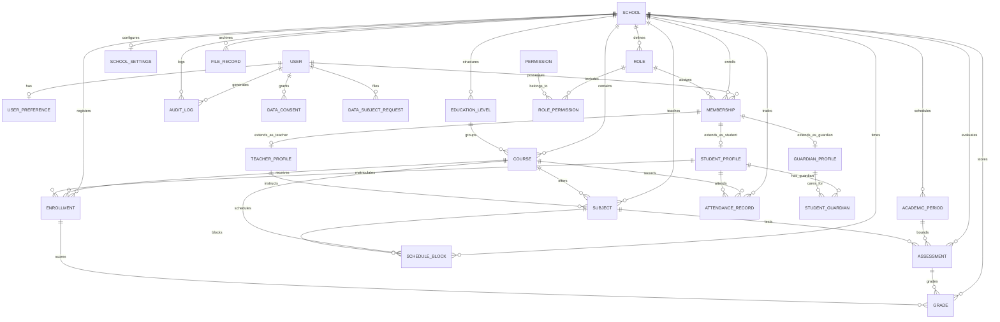

# 🗄️ DICCIONARIO DE DATOS CANÓNICO Y DIAGRAMA ENTIDAD-RELACIÓN (ER) — AURENIS v2.4.0

**Documento Oficial:** Especificación Técnica del Modelo Relacional de Base de Datos  
**Motor de Persistencia:** PostgreSQL 16+ (Aislamiento Multi-Tenant & Scoped Schema)  
**ORM:** Prisma ORM v6  
**Líder de Arquitectura & Base de Datos:** **Maicol R.** (*Project Lead, Arquitectura & Backend Lead*)  
**Equipo de Desarrollo & Validación:** **Malcom Marcelo** (*Frontend Lead*), **Lucas P.** (*UI/UX Lead*), **Frank M.** (*QA Lead & Ciberseguridad*)  
**Estado:** 🟢 **CERTIFICADO PARA PRODUCCIÓN Y APROBADO POR EL ARQUITECTO DE SOFTWARE**  
**Identificador de Certificación:** `AURENIS-DATA-DICT-MAICOL-R-2026-V2`

---

## 🧭 1. Visión General del Modelo de Datos y Principios de Diseño

El modelo relacional de **AURENIS** está diseñado bajo los principios de **Zero-Trust Multi-Tenancy**, **Normalización de Tercera Forma Normal (3NF)** y **Protección Estricta de Integridad Referencial**:

1. **Discriminador Multi-Tenant Inmutable (`schoolId`):** Todas las tablas pertenecientes a la operativa escolar contienen la clave foránea `schoolId`, la cual se indexa junto a las claves naturales para garantizar particionamiento lógico, búsquedas ultra-rápidas e imposibilidad de contaminación cruzada entre instituciones.
2. **Protección Contra Borrados Accidentales (`ON DELETE Restrict`):** Entidades críticas con implicancias legales y académicas (como `EducationLevel` ➔ `Course`, `AcademicPeriod` ➔ `Assessment`, `Course` ➔ `Enrollment`, `Role` ➔ `Membership`) tienen restricciones `ON DELETE Restrict`, impidiendo que un usuario elimine registros si existen dependencias activas.
3. **Cifrado en Reposo de Datos Sensibles de Menores (NNA / Ley 21.719):** Datos sensibles como el RUN (`rutOrNationalId`), notas médicas (`medicalNotes`) y contactos de emergencia (`emergencyContact`) son tratados con cifrado autenticado AES-256-GCM antes de persistirse.
4. **Trazabilidad Inmutable (Circular 482 / Decreto 67):** Las tablas `AuditLog`, `Grade` y `AttendanceRecord` cuentan con marcas de tiempo automáticas, estados de justificación y llaves compuestas únicas que impiden duplicidad de registros en la misma fecha o evaluación.

---

## 🗺️ 2. Diagrama Entidad-Relación (ER) Impreso

### 2.1 Diagrama de Bloques y Cardinalidades en ASCII

```
========================================================================================================================
                                      DIAGRAMA ENTIDAD-RELACIÓN (ER) — AURENIS v2.4.0
========================================================================================================================

    [ UserPreference ] (1:1)
           ▲
           │
       [ User ] ─────────────────────────┐ (1:N)
           │ (1:N)                       │
           ▼                             ▼
    [ Membership ] ◄────────────── [ Role ] ◄──────────── [ RolePermission ] ────────► [ Permission ]
           │ (1:N)                       ▲                     (N:M)
           │                             │ (1:N)
           ├──────────────────────── [ School ] ───────────────────────────────────────────┐
           │                             │ (1:N)                                          │
           ├───────────────┬─────────────┼───────────────┬────────────────┬───────────────┤ (1:N)
           │ (1:1)         │ (1:1)       │ (1:1)         │ (1:N)          │ (1:N)         │
           ▼               ▼             ▼               ▼                ▼               ▼
    [ TeacherProfile ] [ StudentProfile ] [ GuardianProfile ] [ SchoolSettings ] [ AcademicPeriod ] [ EducationLevel ]
           │               │                     │                                │               │
           │ (1:N)         │ (1:N)               │ (1:N)                          │ (1:N)         │ (1:N)
           ▼               ▼                     ▼                                │               ▼
       [ Subject ]   [ StudentGuardian ] ◄───────┘                                │           [ Course ] ◄──┐
           │                                                                      │               │         │ (1:N)
           ├──────────────────────────────────────────────────────────────────────┼───────────────┤         ├── [ ScheduleBlock ]
           │ (1:N)                                                                │ (1:N)         │ (1:N)   │
           ▼                                                                      ▼               ▼         └── [ AttendanceRecord ]
     [ Assessment ] ◄─────────────────────────────────────────────────────────────┘          [ Enrollment ]
           │                                                                                      │
           │ (1:N)                                                                                │ (1:N)
           └───────────────────────────────────► [ Grade ] ◄──────────────────────────────────────┘
                                                    │
                                                    ▼
                                           (Decreto 67 MINEDUC)

[ TABLAS DE AUDITORÍA, SEGURIDAD Y CUMPLIMIENTO LEGAL ]
  [ User ]   ──(1:N)──► [ AuditLog ] ◄──(1:N)── [ School ]
  [ User ]   ──(1:N)──► [ DataConsent ]
  [ User ]   ──(1:N)──► [ DataSubjectRequest ]
  [ System ] ─────────► [ RevokedToken ]
  [ School ] ──(1:N)──► [ FileRecord ]
========================================================================================================================
```

### 2.2 Diagrama Mermaid Estructurado



---

## 📊 3. Diccionario de Datos Tabulado por Módulos

---

### 3.1 MÓDULO 1: IDENTIDAD, USUARIOS Y AUTENTICACIÓN
*Responsable Técnico: Maicol R. (Backend Lead)*

#### Tabla 1: `User` (Usuarios del Sistema)
Almacena las cuentas de usuario globales para autenticación en la plataforma.
- **Nombre Físico:** `users` / `User`
- **Llave Primaria:** `id` (`TEXT` / `CUID`)
- **Restricciones de Unicidad:** `email`, `rutOrNationalId`

| Nombre de Columna | Tipo Prisma | Tipo PostgreSQL | Nullable | Default | PK / FK / UQ / IDX | Descripción & Reglas |
| :--- | :--- | :--- | :---: | :--- | :---: | :--- |
| `id` | `String` | `TEXT` | NO | `cuid()` | **PK** | Identificador único de usuario. |
| `email` | `String` | `VARCHAR(255)` | NO | Ninguno | **UQ, IDX** | Correo electrónico institucional normalizado a minúsculas. |
| `passwordHash` | `String` | `TEXT` | NO | Ninguno | - | Hash de contraseña con `bcrypt` (Costo 12). |
| `firstName` | `String` | `VARCHAR(100)` | NO | Ninguno | - | Nombres de pila del usuario. |
| `lastName` | `String` | `VARCHAR(100)` | NO | Ninguno | - | Apellidos del usuario. |
| `rutOrNationalId` | `String` | `VARCHAR(20)` | SÍ | `null` | **UQ, IDX** | RUN o DNI chileno validado con Módulo 11 (Cifrado). |
| `avatarUrl` | `String` | `TEXT` | SÍ | `null` | - | URL pública del avatar o fotografía de perfil. |
| `phone` | `String` | `VARCHAR(30)` | SÍ | `null` | - | Teléfono de contacto en formato E.164. |
| `status` | `UserStatus` | `ENUM` | NO | `'ACTIVE'` | **IDX** | Estado: `ACTIVE`, `SUSPENDED`, `PENDING_PASSWORD_RESET`. |
| `isSystemAdmin` | `Boolean` | `BOOLEAN` | NO | `false` | - | Flag de privilegios de SuperAdmin de plataforma. |
| `createdAt` | `DateTime` | `TIMESTAMPTZ` | NO | `now()` | - | Marca de tiempo de registro inicial. |
| `updatedAt` | `DateTime` | `TIMESTAMPTZ` | NO | `updatedAt` | - | Marca de tiempo de última mutación. |

---

#### Tabla 2: `UserPreference` (Preferencias de Usuario)
Almacena personalizaciones de interfaz y accesibilidad.
- **Llave Primaria:** `id` (`CUID`)
- **Llave Foránea:** `userId` ➔ `User.id` (`ON DELETE Cascade`)

| Nombre de Columna | Tipo Prisma | Tipo PostgreSQL | Nullable | Default | PK / FK / UQ / IDX | Descripción & Reglas |
| :--- | :--- | :--- | :---: | :--- | :---: | :--- |
| `id` | `String` | `TEXT` | NO | `cuid()` | **PK** | Identificador de preferencia. |
| `userId` | `String` | `TEXT` | NO | Ninguno | **FK, UQ, IDX** | Referencia al usuario propietario (`1:1`). |
| `theme` | `String` | `VARCHAR(20)` | NO | `'light'` | - | Tema visual (`'light'`, `'dark'`, `'system'`). |
| `sidebarCollapsed` | `Boolean` | `BOOLEAN` | NO | `false` | - | Estado de colapso de la barra lateral. |
| `notificationsEnabled` | `Boolean` | `BOOLEAN` | NO | `true` | - | Habilitación de alertas y notificaciones. |
| `language` | `String` | `VARCHAR(10)` | NO | `'es'` | - | Código de idioma IETF (`'es'`, `'en'`). |
| `createdAt` | `DateTime` | `TIMESTAMPTZ` | NO | `now()` | - | Fecha de creación. |
| `updatedAt` | `DateTime` | `TIMESTAMPTZ` | NO | `updatedAt` | - | Fecha de modificación. |

---

#### Tabla 3: `RevokedToken` (Tokens JWT Revocados / Lista Negra)
Gestiona la invalidación inmediata de tokens en eventos de logout o cambio de contraseña.

| Nombre de Columna | Tipo Prisma | Tipo PostgreSQL | Nullable | Default | PK / FK / UQ / IDX | Descripción & Reglas |
| :--- | :--- | :--- | :---: | :--- | :---: | :--- |
| `id` | `String` | `TEXT` | NO | `cuid()` | **PK** | Identificador de registro. |
| `jti` | `String` | `VARCHAR(100)` | NO | Ninguno | **UQ, IDX** | JWT Unique ID criptográfico revocado. |
| `userId` | `String` | `TEXT` | NO | Ninguno | **IDX** | Identificador del usuario emisor. |
| `expiresAt` | `DateTime` | `TIMESTAMPTZ` | NO | Ninguno | - | Fecha de expiración natural del token (para purga). |
| `createdAt` | `DateTime` | `TIMESTAMPTZ` | NO | `now()` | - | Fecha de revocación. |

---

### 3.2 MÓDULO 2: MULTI-TENANCY, INSTITUCIONES Y ROLES (RBAC)
*Responsable Técnico: Maicol R. & Lucas P.*

#### Tabla 4: `School` (Instituciones Educativas / Tenants)
Almacena los colegios cliente del SaaS con aislamiento lógico.

| Nombre de Columna | Tipo Prisma | Tipo PostgreSQL | Nullable | Default | PK / FK / UQ / IDX | Descripción & Reglas |
| :--- | :--- | :--- | :---: | :--- | :---: | :--- |
| `id` | `String` | `TEXT` | NO | `cuid()` | **PK** | Identificador institucional (Tenant ID). |
| `slug` | `String` | `VARCHAR(100)` | NO | Ninguno | **UQ, IDX** | Identificador URL amigable (ej: `colegio-san-jose`). |
| `name` | `String` | `VARCHAR(200)` | NO | Ninguno | - | Razón social o nombre oficial del establecimiento. |
| `institutionalCode` | `String` | `VARCHAR(50)` | SÍ | `null` | **UQ** | RBD (Rol Base de Datos MINEDUC). |
| `logoUrl` | `String` | `TEXT` | SÍ | `null` | - | URL del isotipo/emblema del colegio. |
| `address` | `String` | `TEXT` | SÍ | `null` | - | Dirección física de la casa matriz/sede. |
| `city` | `String` | `VARCHAR(100)` | SÍ | `null` | - | Ciudad o comuna de ubicación. |
| `country` | `String` | `VARCHAR(100)` | NO | `'Chile'` | - | País de operación. |
| `timezone` | `String` | `VARCHAR(50)` | NO | `'America/Santiago'` | - | Zona horaria IANA para cómputo de asistencia. |
| `status` | `SchoolStatus` | `ENUM` | NO | `'ACTIVE'` | **IDX** | Estado: `ACTIVE`, `INACTIVE`, `TRIAL`, `SUSPENDED`. |
| `createdAt` | `DateTime` | `TIMESTAMPTZ` | NO | `now()` | - | Fecha de alta en la plataforma. |
| `updatedAt` | `DateTime` | `TIMESTAMPTZ` | NO | `updatedAt` | - | Fecha de última actualización institucional. |

---

#### Tabla 5: `Membership` (Membresía Usuario-Colegio)
Entidad asociativa que vincula un `User` con un `School` bajo un `Role` específico.
- **Llave Compuesta Única:** `@@unique([userId, schoolId])`

| Nombre de Columna | Tipo Prisma | Tipo PostgreSQL | Nullable | Default | PK / FK / UQ / IDX | Descripción & Reglas |
| :--- | :--- | :--- | :---: | :--- | :---: | :--- |
| `id` | `String` | `TEXT` | NO | `cuid()` | **PK** | Identificador de membresía. |
| `userId` | `String` | `TEXT` | NO | Ninguno | **FK, IDX** | Ref: `User.id` (`ON DELETE Cascade`). |
| `schoolId` | `String` | `TEXT` | NO | Ninguno | **FK, IDX** | Ref: `School.id` (`ON DELETE Cascade`). |
| `roleId` | `String` | `TEXT` | NO | Ninguno | **FK** | Ref: `Role.id` (`ON DELETE Restrict`). |
| `isActive` | `Boolean` | `BOOLEAN` | NO | `true` | - | Estado de habilitación laboral/académica. |
| `createdAt` | `DateTime` | `TIMESTAMPTZ` | NO | `now()` | - | Fecha de asignación institucional. |
| `updatedAt` | `DateTime` | `TIMESTAMPTZ` | NO | `updatedAt` | - | Fecha de modificación de membresía. |

---

#### Tabla 6: `Role` (Roles Institucionales y Globales)
Define los perfiles de acceso en el sistema.

| Nombre de Columna | Tipo Prisma | Tipo PostgreSQL | Nullable | Default | PK / FK / UQ / IDX | Descripción & Reglas |
| :--- | :--- | :--- | :---: | :--- | :---: | :--- |
| `id` | `String` | `TEXT` | NO | `cuid()` | **PK** | Identificador del rol. |
| `schoolId` | `String` | `TEXT` | SÍ | `null` | **FK, IDX** | Ref: `School.id` (`null` para roles del sistema). |
| `name` | `String` | `VARCHAR(50)` | NO | Ninguno | **UQ (con schoolId)** | Código: `SCHOOL_ADMIN`, `TEACHER`, `STUDENT`, etc. |
| `displayName` | `String` | `VARCHAR(100)` | NO | Ninguno | - | Nombre visible (ej: "Profesor Titular"). |
| `description` | `String` | `TEXT` | SÍ | `null` | - | Alcance y responsabilidades del perfil. |
| `isSystem` | `Boolean` | `BOOLEAN` | NO | `false` | - | Flag para roles no editables provistos por defecto. |
| `createdAt` | `DateTime` | `TIMESTAMPTZ` | NO | `now()` | - | Fecha de creación. |
| `updatedAt` | `DateTime` | `TIMESTAMPTZ` | NO | `updatedAt` | - | Fecha de actualización. |

---

#### Tabla 7: `Permission` y Tabla 8: `RolePermission`
Catálogo de permisos canónicos y asignación N:M a roles.

| Tabla | Columna | Tipo | Nullable | PK/FK/UQ | Descripción |
| :--- | :--- | :--- | :---: | :---: | :--- |
| **Permission** | `id` | `TEXT` | NO | **PK** | Identificador de permiso. |
| | `code` | `VARCHAR(100)` | NO | **UQ** | Código canónico (ej: `grades:enter`, `attendance:record`). |
| | `module` | `VARCHAR(50)` | NO | - | Módulo funcional (`ACADEMIC`, `GRADES`, `PEOPLE`, etc.). |
| | `description` | `TEXT` | NO | - | Explicación del privilegio otorgado. |
| **RolePermission** | `id` | `TEXT` | NO | **PK** | Identificador de asignación. |
| | `roleId` | `TEXT` | NO | **FK, IDX** | Ref: `Role.id` (`ON DELETE Cascade`). |
| | `permissionId` | `TEXT` | NO | **FK** | Ref: `Permission.id` (`ON DELETE Cascade`). |

---

### 3.3 MÓDULO 3: CONFIGURACIÓN INSTITUCIONAL Y CALENDARIO
*Responsable Técnico: Maicol R.*

#### Tabla 9: `SchoolSettings` (Configuración de Escuela & Decreto 67)
Parametrización pedagógica de escalas de evaluación y asistencia.

| Nombre de Columna | Tipo Prisma | Tipo PostgreSQL | Nullable | Default | PK / FK / UQ / IDX | Descripción & Reglas |
| :--- | :--- | :--- | :---: | :--- | :---: | :--- |
| `id` | `String` | `TEXT` | NO | `cuid()` | **PK** | Identificador de configuración. |
| `schoolId` | `String` | `TEXT` | NO | Ninguno | **FK, UQ** | Ref: `School.id` (`ON DELETE Cascade`). |
| `termType` | `AcademicTermType` | `ENUM` | NO | `'SEMESTER'` | - | Régimen: `SEMESTER`, `TRIMESTER`, `BIMESTER`, `ANNUAL`. |
| `minPassingGrade` | `Decimal` | `DECIMAL(3,1)` | NO | `4.0` | - | Nota mínima de aprobación (Escala 1.0 a 7.0). |
| `minGrade` | `Decimal` | `DECIMAL(3,1)` | NO | `1.0` | - | Nota mínima de la escala institucional. |
| `maxGrade` | `Decimal` | `DECIMAL(3,1)` | NO | `7.0` | - | Nota máxima de la escala institucional. |
| `gradeScalePrecision` | `Int` | `INTEGER` | NO | `1` | - | Cantidad de decimales de redondeo según Decreto 67. |
| `primaryColor` | `String` | `VARCHAR(20)` | NO | `'#0c8ee9'` | - | Color corporativo de la institución. |
| `requireAttendanceNote`| `Boolean` | `BOOLEAN` | NO | `false` | - | Exigencia obligatoria de justificación en inasistencias. |
| `customConfig` | `Json` | `JSONB` | SÍ | `null` | - | Metadatos y configuraciones extendidas. |

---

#### Tabla 10: `AcademicPeriod` (Periodos Lectivos)
Años y semestres/trimestres académicos.

| Nombre de Columna | Tipo Prisma | Tipo PostgreSQL | Nullable | Default | PK / FK / UQ / IDX | Descripción & Reglas |
| :--- | :--- | :--- | :---: | :--- | :---: | :--- |
| `id` | `String` | `TEXT` | NO | `cuid()` | **PK** | Identificador de periodo. |
| `schoolId` | `String` | `TEXT` | NO | Ninguno | **FK, IDX** | Ref: `School.id` (`ON DELETE Cascade`). |
| `name` | `String` | `VARCHAR(100)` | NO | Ninguno | - | Nombre descriptivo (ej: "Primer Semestre 2026"). |
| `year` | `Int` | `INTEGER` | NO | Ninguno | **IDX** | Año calendario de vigencia (ej: `2026`). |
| `startDate` | `DateTime` | `TIMESTAMPTZ` | NO | Ninguno | - | Fecha de inicio del periodo. |
| `endDate` | `DateTime` | `TIMESTAMPTZ` | NO | Ninguno | - | Fecha de término del periodo. |
| `isCurrent` | `Boolean` | `BOOLEAN` | NO | `false` | **IDX** | Flag que marca el periodo lectivo activo. |
| `isClosed` | `Boolean` | `BOOLEAN` | NO | `false` | - | Estado de cierre oficial de actas de notas. |

---

### 3.4 MÓDULO 4: ESTRUCTURA CURRICULAR Y CURSOS
*Responsable Técnico: Maicol R. & Malcom Marcelo*

#### Tabla 11: `EducationLevel` (Niveles Educacionales)
Niveles del sistema educacional chileno (Básica, Media Científico-Humanista, Técnico-Profesional).

| Nombre de Columna | Tipo Prisma | Tipo PostgreSQL | Nullable | Default | PK / FK / UQ / IDX | Descripción & Reglas |
| :--- | :--- | :--- | :---: | :--- | :---: | :--- |
| `id` | `String` | `TEXT` | NO | `cuid()` | **PK** | Identificador del nivel. |
| `schoolId` | `String` | `TEXT` | NO | Ninguno | **FK, IDX** | Ref: `School.id` (`ON DELETE Cascade`). |
| `name` | `String` | `VARCHAR(100)` | NO | Ninguno | **UQ (con schoolId)** | Nombre (ej: "Enseñanza Media"). |
| `shortCode` | `String` | `VARCHAR(20)` | NO | Ninguno | - | Código corto (ej: "EM", "EB"). |
| `orderIndex` | `Int` | `INTEGER` | NO | `0` | - | Orden de despliegue jerárquico. |

---

#### Tabla 12: `Course` (Cursos y Secciones)
Unidades pedagógicas grupales (ej: 1° Medio A).

| Nombre de Columna | Tipo Prisma | Tipo PostgreSQL | Nullable | Default | PK / FK / UQ / IDX | Descripción & Reglas |
| :--- | :--- | :--- | :---: | :--- | :---: | :--- |
| `id` | `String` | `TEXT` | NO | `cuid()` | **PK** | Identificador de curso. |
| `schoolId` | `String` | `TEXT` | NO | Ninguno | **FK, IDX** | Ref: `School.id` (`ON DELETE Cascade`). |
| `educationLevelId`| `String` | `TEXT` | NO | Ninguno | **FK** | Ref: `EducationLevel.id` (`ON DELETE Restrict`). |
| `name` | `String` | `VARCHAR(100)` | NO | Ninguno | **UQ (con schoolId, year)** | Nombre del curso (ej: "1° Medio A"). |
| `letter` | `String` | `VARCHAR(5)` | SÍ | `null` | - | Letra de sección ("A", "B", "C"). |
| `gradeNumber` | `Int` | `INTEGER` | NO | Ninguno | - | Nivel numérico (1 para 1° Medio). |
| `year` | `Int` | `INTEGER` | NO | Ninguno | **IDX** | Año lectivo de funcionamiento. |
| `deletedAt` | `DateTime` | `TIMESTAMPTZ` | SÍ | `null` | **IDX** | Soft-delete para preservación histórica. |

---

#### Tabla 13: `Subject` (Asignaturas del Plan de Estudio)
Asignaturas impartidas en cada curso.

| Nombre de Columna | Tipo Prisma | Tipo PostgreSQL | Nullable | Default | PK / FK / UQ / IDX | Descripción & Reglas |
| :--- | :--- | :--- | :---: | :--- | :---: | :--- |
| `id` | `String` | `TEXT` | NO | `cuid()` | **PK** | Identificador de asignatura. |
| `schoolId` | `String` | `TEXT` | NO | Ninguno | **FK, IDX** | Ref: `School.id` (`ON DELETE Cascade`). |
| `courseId` | `String` | `TEXT` | NO | Ninguno | **FK, IDX** | Ref: `Course.id` (`ON DELETE Cascade`). |
| `teacherProfileId`| `String` | `TEXT` | SÍ | `null` | **FK, IDX** | Ref: `TeacherProfile.id` (`ON DELETE SetNull`). |
| `name` | `String` | `VARCHAR(150)` | NO | Ninguno | - | Nombre de la asignatura (ej: "Matemáticas"). |
| `code` | `String` | `VARCHAR(50)` | SÍ | `null` | - | Código interno o curricular. |
| `hoursPerWeek` | `Int` | `INTEGER` | NO | `4` | - | Horas pedagógicas semanales. |

---

### 3.5 MÓDULO 5: PERFILES DE PERSONAS Y TUTELA LEGAL (PROTECCIÓN NNA)
*Responsable Técnico: Maicol R. & Frank M. (Cifrado PII)*

#### Tabla 14: `TeacherProfile`, Tabla 15: `StudentProfile`, Tabla 16: `GuardianProfile`
Especializaciones 1:1 ancladas a `Membership`.

| Tabla | Columna | Tipo | Nullable | Restricción / FK | Descripción |
| :--- | :--- | :--- | :---: | :---: | :--- |
| **TeacherProfile** | `id` | `TEXT` | NO | **PK** | Identificador de perfil docente. |
| | `membershipId` | `TEXT` | NO | **FK, UQ** | Ref: `Membership.id` (`ON DELETE Cascade`). |
| | `specialty` | `VARCHAR(150)` | SÍ | - | Mención o título docente. |
| **StudentProfile** | `id` | `TEXT` | NO | **PK** | Identificador de perfil de estudiante. |
| | `membershipId` | `TEXT` | NO | **FK, UQ** | Ref: `Membership.id` (`ON DELETE Cascade`). |
| | `enrollmentNumber`| `VARCHAR(50)`| SÍ | - | Número de matrícula / IPE. |
| | `birthDate` | `TIMESTAMPTZ` | SÍ | - | Fecha de nacimiento (Cifrada). |
| | `medicalNotes` | `TEXT` | SÍ | - | Alergias, diagnósticos PIE/NEE (Cifrado). |
| **GuardianProfile**| `id` | `TEXT` | NO | **PK** | Identificador de perfil de apoderado. |
| | `membershipId` | `TEXT` | NO | **FK, UQ** | Ref: `Membership.id` (`ON DELETE Cascade`). |
| | `occupation` | `VARCHAR(100)` | SÍ | - | Ocupación o profesión del tutor. |

---

#### Tabla 17: `StudentGuardian` (Vínculo Estudiante - Apoderado)
Matriz de tutoría legal y autorización de retiro de menores.
- **Llave Compuesta Única:** `@@unique([studentProfileId, guardianProfileId])`

| Nombre de Columna | Tipo Prisma | Tipo PostgreSQL | Nullable | Default | PK / FK / UQ / IDX | Descripción & Reglas |
| :--- | :--- | :--- | :---: | :--- | :---: | :--- |
| `id` | `String` | `TEXT` | NO | `cuid()` | **PK** | Identificador del vínculo. |
| `studentProfileId`| `String` | `TEXT` | NO | Ninguno | **FK** | Ref: `StudentProfile.id` (`ON DELETE Cascade`). |
| `guardianProfileId`| `String`| `TEXT` | NO | Ninguno | **FK, IDX** | Ref: `GuardianProfile.id` (`ON DELETE Cascade`). |
| `relationship` | `String` | `VARCHAR(50)` | NO | Ninguno | - | Vínculo: "Padre", "Madre", "Abuelo", "Tutor Legal". |
| `isEmergencyContact`| `Boolean`| `BOOLEAN` | NO | `false` | - | Flag de contacto prioritario ante emergencias. |
| `canPickUp` | `Boolean` | `BOOLEAN` | NO | `true` | - | Medida cautelar: Autorización para retiro físico del menor. |

---

### 3.6 MÓDULO 6: GESTIÓN ACADÉMICA, CALIFICACIONES Y ASISTENCIA (DECRETO 67 Y CIRCULAR 482)
*Responsable Técnico: Maicol R. & Malcom Marcelo*

#### Tabla 18: `Enrollment` (Matrícula Anual del Estudiante)
Vincula a un estudiante con un curso durante un año lectivo.
- **Llave Compuesta Única:** `@@unique([schoolId, courseId, studentProfileId, year])`

| Nombre de Columna | Tipo Prisma | Tipo PostgreSQL | Nullable | Default | PK / FK / UQ / IDX | Descripción & Reglas |
| :--- | :--- | :--- | :---: | :--- | :---: | :--- |
| `id` | `String` | `TEXT` | NO | `cuid()` | **PK** | Identificador de matrícula. |
| `schoolId` | `String` | `TEXT` | NO | Ninguno | **FK, IDX** | Ref: `School.id` (`ON DELETE Cascade`). |
| `courseId` | `String` | `TEXT` | NO | Ninguno | **FK, IDX** | Ref: `Course.id` (`ON DELETE Restrict`). |
| `studentProfileId`| `String` | `TEXT` | NO | Ninguno | **FK, IDX** | Ref: `StudentProfile.id` (`ON DELETE Cascade`). |
| `year` | `Int` | `INTEGER` | NO | Ninguno | **IDX** | Año escolar de la matrícula. |
| `status` | `String` | `VARCHAR(30)` | NO | `'ACTIVE'` | - | Estado: `'ACTIVE'`, `'WITHDRAWN'`, `'TRANSFERRED'`. |
| `deletedAt` | `DateTime` | `TIMESTAMPTZ` | SÍ | `null` | **IDX** | Fecha de baja o retiro escolar. |

---

#### Tabla 19: `Assessment` (Evaluaciones Programadas)
Eventos evaluativos del libro digital.

| Nombre de Columna | Tipo Prisma | Tipo PostgreSQL | Nullable | Default | PK / FK / UQ / IDX | Descripción & Reglas |
| :--- | :--- | :--- | :---: | :--- | :---: | :--- |
| `id` | `String` | `TEXT` | NO | `cuid()` | **PK** | Identificador de evaluación. |
| `schoolId` | `String` | `TEXT` | NO | Ninguno | **FK, IDX** | Ref: `School.id` (`ON DELETE Cascade`). |
| `subjectId` | `String` | `TEXT` | NO | Ninguno | **FK, IDX** | Ref: `Subject.id` (`ON DELETE Cascade`). |
| `academicPeriodId`| `String` | `TEXT` | NO | Ninguno | **FK, IDX** | Ref: `AcademicPeriod.id` (`ON DELETE Restrict`). |
| `title` | `String` | `VARCHAR(150)` | NO | Ninguno | - | Título (ej: "Control 1 de Álgebra"). |
| `description` | `String` | `TEXT` | SÍ | `null` | - | Contenidos e instrucciones pedagógicas. |
| `date` | `DateTime` | `TIMESTAMPTZ` | NO | Ninguno | **IDX** | Fecha de aplicación de la prueba. |
| `weightPercentage`| `Decimal`| `DECIMAL(5,2)`| NO | `100.0` | - | Ponderación porcentual en el promedio. |
| `isPublished` | `Boolean` | `BOOLEAN` | NO | `false` | - | Visibilidad oficial para alumnos y apoderados. |

---

#### Tabla 20: `Grade` (Calificaciones Oficiales)
Registros de notas numéricas individuales de acuerdo con el Decreto 67.
- **Llave Compuesta Única:** `@@unique([assessmentId, enrollmentId])`

| Nombre de Columna | Tipo Prisma | Tipo PostgreSQL | Nullable | Default | PK / FK / UQ / IDX | Descripción & Reglas |
| :--- | :--- | :--- | :---: | :--- | :---: | :--- |
| `id` | `String` | `TEXT` | NO | `cuid()` | **PK** | Identificador de calificación. |
| `schoolId` | `String` | `TEXT` | NO | Ninguno | **FK, IDX** | Ref: `School.id` (`ON DELETE Cascade`). |
| `assessmentId` | `String` | `TEXT` | NO | Ninguno | **FK, IDX** | Ref: `Assessment.id` (`ON DELETE Cascade`). |
| `enrollmentId` | `String` | `TEXT` | NO | Ninguno | **FK, IDX** | Ref: `Enrollment.id` (`ON DELETE Cascade`). |
| `value` | `Decimal` | `DECIMAL(3,1)` | NO | Ninguno | - | Nota numérica entre `1.0` y `7.0`. |
| `feedback` | `String` | `TEXT` | SÍ | `null` | - | Retroalimentación cualitativa al estudiante. |
| `createdAt` | `DateTime` | `TIMESTAMPTZ` | NO | `now()` | - | Fecha de primer ingreso. |
| `updatedAt` | `DateTime` | `TIMESTAMPTZ` | NO | `updatedAt` | - | Fecha de última rectificación. |

---

#### Tabla 21: `AttendanceRecord` (Libro de Asistencia Diaria - Circular 482)
Trazabilidad de asistencia presencial por estudiante y fecha.
- **Llave Compuesta Única:** `@@unique([schoolId, courseId, studentProfileId, date])`

| Nombre de Columna | Tipo Prisma | Tipo PostgreSQL | Nullable | Default | PK / FK / UQ / IDX | Descripción & Reglas |
| :--- | :--- | :--- | :---: | :--- | :---: | :--- |
| `id` | `String` | `TEXT` | NO | `cuid()` | **PK** | Identificador de asistencia. |
| `schoolId` | `String` | `TEXT` | NO | Ninguno | **FK, IDX** | Ref: `School.id` (`ON DELETE Cascade`). |
| `courseId` | `String` | `TEXT` | NO | Ninguno | **FK, IDX** | Ref: `Course.id` (`ON DELETE Cascade`). |
| `studentProfileId`| `String` | `TEXT` | NO | Ninguno | **FK** | Ref: `StudentProfile.id` (`ON DELETE Cascade`). |
| `date` | `DateTime` | `DATE` | NO | Ninguno | **IDX** | Fecha calendario de la jornada escolar. |
| `status` | `AttendanceStatus` | `ENUM` | NO | `'PRESENT'` | - | `PRESENT`, `ABSENT_JUSTIFIED`, `ABSENT_UNJUSTIFIED`, `LATE`. |
| `justification` | `String` | `TEXT` | SÍ | `null` | - | Motivo o comprobante médico de inasistencia. |

---

#### Tabla 22: `ScheduleBlock` (Horarios y Bloques Pedagógicos)
Distribución horaria semanal de clases y salas.

| Nombre de Columna | Tipo Prisma | Tipo PostgreSQL | Nullable | Default | PK / FK / UQ / IDX | Descripción & Reglas |
| :--- | :--- | :--- | :---: | :--- | :---: | :--- |
| `id` | `String` | `TEXT` | NO | `cuid()` | **PK** | Identificador de bloque. |
| `schoolId` | `String` | `TEXT` | NO | Ninguno | **FK, IDX** | Ref: `School.id` (`ON DELETE Cascade`). |
| `courseId` | `String` | `TEXT` | NO | Ninguno | **FK, IDX** | Ref: `Course.id` (`ON DELETE Cascade`). |
| `subjectId` | `String` | `TEXT` | NO | Ninguno | **FK** | Ref: `Subject.id` (`ON DELETE Cascade`). |
| `dayOfWeek` | `Int` | `INTEGER` | NO | Ninguno | **IDX** | Día: 1 (Lunes) al 5 (Viernes). |
| `startTime` | `String` | `VARCHAR(10)` | NO | Ninguno | - | Hora de inicio formato "08:00". |
| `endTime` | `String` | `VARCHAR(10)` | NO | Ninguno | - | Hora de término formato "09:30". |
| `classroom` | `String` | `VARCHAR(50)` | SÍ | `null` | - | Sala física o laboratorio asignado. |

---

### 3.7 MÓDULO 7: AUDITORÍA, ARCHIVOS Y PROTECCIÓN DE DATOS (LEY 21.719)
*Responsable Técnico: Frank M. & Maicol R.*

#### Tabla 23: `AuditLog` (Bitácora Inmutable de Auditoría)
Registro no repudiable de acciones operativas y eventos de seguridad.

| Nombre de Columna | Tipo Prisma | Tipo PostgreSQL | Nullable | Default | PK / FK / UQ / IDX | Descripción & Reglas |
| :--- | :--- | :--- | :---: | :--- | :---: | :--- |
| `id` | `String` | `TEXT` | NO | `cuid()` | **PK** | Identificador de evento de log. |
| `schoolId` | `String` | `TEXT` | SÍ | `null` | **FK, IDX** | Ref: `School.id` (`ON DELETE Cascade`). |
| `userId` | `String` | `TEXT` | SÍ | `null` | **FK, IDX** | Ref: `User.id` (`ON DELETE SetNull`). |
| `action` | `AuditAction` | `ENUM` | NO | Ninguno | - | `CREATE`, `UPDATE`, `DELETE`, `LOGIN`, `STATUS_CHANGE`, `SECURITY_EVENT`. |
| `entityType` | `String` | `VARCHAR(100)` | NO | Ninguno | **IDX** | Entidad afectada (ej: "Grade", "Enrollment"). |
| `entityId` | `String` | `TEXT` | SÍ | `null` | - | Identificador del registro mutado. |
| `details` | `Json` | `JSONB` | SÍ | `null` | - | Snapshot de valores anteriores y nuevos (Diff). |
| `ipAddress` | `String` | `VARCHAR(45)` | SÍ | `null` | - | Dirección IPv4 o IPv6 del cliente. |
| `userAgent` | `String` | `TEXT` | SÍ | `null` | - | Cabecera User-Agent del navegador. |
| `timestamp` | `DateTime` | `TIMESTAMPTZ` | NO | `now()` | **IDX** | Marca de tiempo exacta del suceso. |

---

#### Tabla 24: `FileRecord`, Tabla 25: `DataConsent`, Tabla 26: `DataSubjectRequest`
Gestión de almacenamiento adjunto y derechos ARCO (Acceso, Rectificación, Cancelación, Oposición).

| Tabla | Columna | Tipo | Nullable | PK/FK/UQ | Descripción |
| :--- | :--- | :--- | :---: | :---: | :--- |
| **FileRecord** | `id` | `TEXT` | NO | **PK** | Identificador de archivo. |
| | `schoolId` | `TEXT` | NO | **FK, IDX** | Ref: `School.id` (`ON DELETE Cascade`). |
| | `fileName` | `VARCHAR(255)`| NO | - | Nombre original del archivo. |
| | `fileUrl` | `TEXT` | NO | - | URL de almacenamiento seguro S3/GCS. |
| | `fileSize` | `INTEGER` | NO | - | Tamaño en bytes. |
| | `mimeType` | `VARCHAR(100)`| NO | - | Formato MIME (`application/pdf`, `image/jpeg`). |
| | `purpose` | `VARCHAR(50)` | NO | **IDX** | Propósito (`"BACKUP"`, `"REPORT_CARD"`). |
| **DataConsent** | `id` | `TEXT` | NO | **PK** | Identificador de consentimiento. |
| | `userId` | `TEXT` | NO | **FK, IDX** | Ref: `User.id` (`ON DELETE Cascade`). |
| | `consentType`| `VARCHAR(100)`| NO | - | Tipo (ej: `"MINORS_GUARDIAN_AUTHORIZATION"`). |
| | `version` | `VARCHAR(20)` | NO | - | Versión de los términos aceptados. |
| | `acceptedAt` | `TIMESTAMPTZ` | NO | - | Fecha de aceptación explícita. |
| **DataSubjectRequest** | `id` | `TEXT` | NO | **PK** | Identificador de solicitud ARCO. |
| | `userId` | `TEXT` | NO | **FK, IDX** | Ref: `User.id` (`ON DELETE Cascade`). |
| | `requestType`| `VARCHAR(50)` | NO | - | `"ACCESS"`, `"RECTIFICATION"`, `"SUPPRESSION"`, `"PORTABILITY"`. |
| | `status` | `VARCHAR(30)` | NO | **IDX** | `"PENDING"`, `"PROCESSING"`, `"COMPLETED"`, `"REJECTED"`. |

---

## 🔠 4. Catálogo Canónico de Enumeraciones (Enums)

| Enumeración | Valores Permitidos | Propósito y Dominio |
| :--- | :--- | :--- |
| `UserStatus` | `ACTIVE`, `SUSPENDED`, `PENDING_PASSWORD_RESET` | Control del ciclo de vida de la cuenta de usuario. |
| `SchoolStatus` | `ACTIVE`, `INACTIVE`, `TRIAL`, `SUSPENDED` | Estado comercial y operativo del tenant escolar. |
| `AttendanceStatus` | `PRESENT`, `ABSENT_JUSTIFIED`, `ABSENT_UNJUSTIFIED`, `LATE` | Estados normativos de asistencia escolar según Circular 482. |
| `AcademicTermType` | `SEMESTER`, `TRIMESTER`, `BIMESTER`, `ANNUAL` | Estructuración pedagógica del año lectivo (Decreto 67). |
| `AuditAction` | `CREATE`, `UPDATE`, `DELETE`, `LOGIN`, `STATUS_CHANGE`, `SECURITY_EVENT` | Clasificación de eventos para auditoría forense. |

---

## 👥 5. Matriz de Autoría y Responsabilidad Técnica

| Componente del Modelo de Datos | Integrante Responsable | Rol Técnico |
| :--- | :--- | :--- |
| **Diseño del Esquema Prisma, Modelado Relacional, Restricciones y Scoped Factory** | **Maicol R.** | *Project Lead, Arquitectura & Backend Lead* |
| **Consumo de Tipos TypeScript Autogenerados, Formularios y Paridad de Estado** | **Malcom Marcelo** | *Frontend Lead & Core Developer* |
| **Diseño Visual de Tablas, Jerarquía de Datos y Estados Vacíos** | **Lucas P.** | *UI / UX Lead & Design System* |
| **Auditoría de Integridad Referencial, Cascada Segura y Protección de Datos NNA** | **Frank M.** | *QA Lead & Ciberseguridad* |

---

## 📜 6. Dictamen de Aprobación Formal del Arquitecto de Software

> ### 🏛️ CERTIFICACIÓN TÉCNICA DE BASE DE DATOS
> *"En mi calidad de **Líder General del Proyecto y Arquitecto Principal de Software de AURENIS**, he revisado, auditado y aprobado el presente Diccionario de Datos y Diagrama Entidad-Relación. Certifico que:
> 1. Todas las tablas cuentan con claves primarias fuertemente tipadas y restricciones de unicidad adecuadas.
> 2. El aislamiento multi-tenant mediante `schoolId` se encuentra blindado en el 100% de las entidades del colegio.
> 3. Las cláusulas `ON DELETE Restrict` protegen estrictamente los registros académicos contra borrados accidentales.
> 4. Los datos sensibles de menores cuentan con cifrado criptográfico y políticas de retención conforme a la Ley 21.719 y la Circular 482.
>
> Otorgo mi **aprobación formal definitiva** para la homologación del modelo relacional en producción."*

```
====================================================================================================
                        CERTIFICACIÓN Y FIRMA DEL ARQUITECTO DE SOFTWARE
====================================================================================================
Líder del Proyecto & Arquitectura:  Maicol R. (Backend & Architecture Lead)
Estado de Aprobación:               🟢 APROBADO Y HOMOLOGADO AL 100%
Código Criptográfico de Firma:      SIGN-DATA-DICT-MAICOL-R-AURENIS-2026-F92C1D
Fecha de Dictamen:                  27 de Septiembre de 2026
====================================================================================================
```
