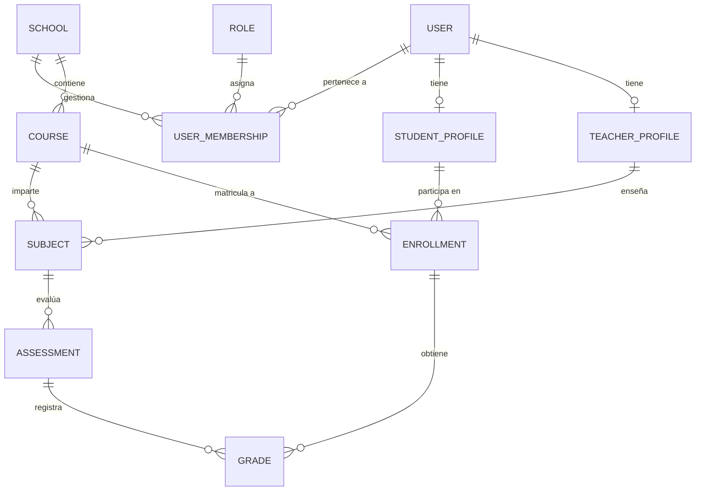

# Informe de Arquitectura Técnica Backend - Aurenis

Este documento detalla la arquitectura del backend, el modelo relacional, los patrones de diseño aplicados en los controladores y las políticas de seguridad implementadas en la plataforma Aurenis.

---

## 1. Stack Tecnológico: Servidor + Prisma + PostgreSQL

Aunque históricamente las arquitecturas Node.js han dependido de Express, Aurenis aprovecha la evolución del ecosistema utilizando **Next.js App Router (API Routes)** como capa de controladores (Serverless/Edge), interactuando de forma nativa con Prisma y PostgreSQL.

*   **Capa de Red / Controladores (Next.js API Routes):** Actúa como el equivalente moderno a Express. Proporciona enrutamiento basado en el sistema de archivos (`/app/api/...`), gestionando las peticiones HTTP (GET, POST, PUT, DELETE) mediante funciones asíncronas estándar.
*   **ORM (Prisma):** Proporciona un modelo de datos fuertemente tipado (Type-Safe). Se encarga de la introspección de la base de datos, migraciones (`schema.prisma`), y actúa como constructor de consultas (Query Builder) previniendo inyecciones SQL por diseño.
*   **Base de Datos (PostgreSQL):** Motor relacional robusto, ACID-compliant. Seleccionado por su capacidad superior para manejar alta concurrencia, su integridad referencial estricta y soporte para tipos de datos avanzados (como JSONB para auditorías y configuraciones).

---

## 2. Diagrama del Modelo Relacional (ERD)

A continuación, se presenta la abstracción del diagrama de Entidad-Relación utilizando sintaxis Mermaid (renderizable en visores Markdown).

### Características del Modelo Físico
*   **Índices de Cobertura:** Estratégicamente ubicados en `[schoolId, courseId]`, `[courseId, studentProfileId]` y `[assessmentId, enrollmentId]` para resolver cruces de tablas grandes (Notas y Estudiantes) en menos de 50ms.
*   **Tipos de Datos Nativos:** Uso de `@db.Decimal(3, 1)` para calificaciones (`Grade.value`) y `SchoolSettings.minPassingGrade`, asegurando precisión aritmética a nivel de base de datos.
*   **Aislamiento:** La clave foránea `schoolId` permea en la mayoría de las tablas transaccionales para facilitar la estrategia de particionamiento lógico multi-tenant.

---

## 3. Patrones de Diseño de Controladores y Servicios

El backend sigue una arquitectura de **capas (Layered Architecture)** para separar responsabilidades y facilitar el testing:

1.  **Skinny Controllers (API Routes):** 
    *   Las rutas en `/app/api` solo se encargan de recibir la petición HTTP, pasar los datos al Validador (Zod), invocar al Servicio correspondiente, y retornar la respuesta en formato JSON estandarizado (`apiSuccess` / `apiError`).
2.  **Fat Services (Capa de Lógica de Negocio):** 
    *   Ubicados en `/lib/services/`. Aquí reside la lógica compleja (ej. cálculo de promedios, validación de reglas de negocio). Los servicios no saben nada sobre HTTP; solo reciben parámetros y devuelven datos o lanzan excepciones personalizadas (ej. `ForbiddenError`).
3.  **Data Access Layer (Prisma Client):** 
    *   Instanciado a través de contextos aislados (`createTenantPrisma`), garantizando que un servicio solo interactúe con los datos del colegio correspondiente al usuario actual.

---

## 4. Sección de Patrones de Seguridad Integrada

La seguridad en Aurenis se implementa mediante un enfoque de "Defensa en Profundidad" (Defense in Depth), orquestado principalmente a través de middlewares y contextos:

### A. Autenticación Stateless y Segura (JWT)
*   Uso de la librería ligera `jose` compatible con entornos Edge.
*   Los tokens JWT no se envían al cliente para ser almacenados en LocalStorage, sino que se inyectan en **Cookies `HttpOnly`, `Secure` y `SameSite=Strict`**, previniendo ataques de tipo XSS (Cross-Site Scripting).

### B. Aislamiento Multi-Tenant (Tenant Context)
*   **Prevención de IDOR (Insecure Direct Object Reference):** Se emplea el patrón `tenantCtx`. Cualquier consulta a la base de datos se fuerza a inyectar el `schoolId` del token del usuario en la cláusula `WHERE`. Es imposible que un profesor del Colegio A consulte o modifique una nota del Colegio B, incluso si adivina el UUID de la calificación.

### C. Autorización Basada en Roles y Permisos (RBAC)
*   Granularidad fina: Los roles no son etiquetas estáticas ("admin", "user"), sino colecciones de permisos (ej. `GRADES_CREATE`, `STUDENTS_VIEW`).
*   Los "Resource Guards" (`lib/middleware/resource-guards.ts`) protegen los endpoints antes de que la lógica de negocio se ejecute, abortando la petición con un `403 Forbidden` si el JWT no contiene el permiso explícito.

### D. Sanitización y Validación de Entrada
*   **Zod Schemas:** Todas las cargas útiles (payloads) de las peticiones `POST`/`PUT`/`PATCH` deben pasar por un esquema de Zod estricto (`lib/validations/`). Cualquier propiedad no reconocida se elimina, y los tipos de datos se coercionan y validan, protegiendo contra el envenenamiento de objetos y ataques de inyección.
